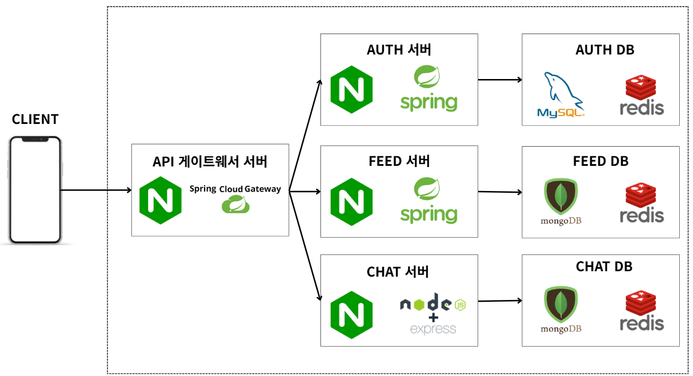
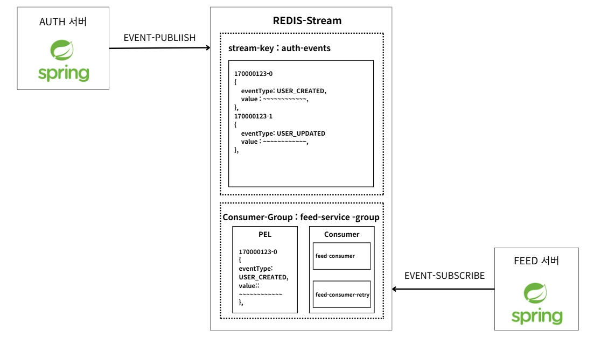

# 🐾 PET_MANAGER_BE

반려동물 케어 서비스 **백엔드** 레포입니다.  
Gateway · Auth · Feed · Chat 4개 마이크로서비스로 구성되어 있으며, **Redis Stream** 기반 이벤트 동기화를 진행합니다.

| 항목 | 내용 |
|------|------|
| Java | 21 · Spring Boot 3.5 |
| Node | NestJS 11 |
| 아키텍처 | MSA · DDD · Hexagonal · Outbox · EDA |

---

## 🏗 Architecture

### 📐 전체 아키텍처

### 💬 채팅 아키텍처

---

## 🖥 서비스 설명

### 🚪 Gateway · `:8080`

  
  
  
  
  

- 앱의 **단일 진입점** — `/api/auth`, `/api/feed`, `/api/chat`, `/socket.io` 라우팅
- Netty 기반 **논블로킹** 비동기 처리로 최소 자원으로 요청 전달
- **JWT 검증·인증** 로직 전담

---

### 🔐 Auth · `:8081`

  
  
  
  
  
  
  
  

**역할** — 인증 / 인가 및 유저 도메인

- JWT + **RTR**(Refresh Token Rotation)로 서버 메모리 절약·보안 강화
- OAuth2 소셜 로그인, SMTP 메일 인증, BCrypt 암호화
- **MySQL Outbox** → 스케줄러가 `auth-events` Stream 발행
- Feed / Chat에 유저 스냅샷 **EDA** 동기화

---

### 📰 Feed · `:8082`

  
  
  
  
  
  

**역할** — 게시글(피드) CRUD 및 미디어 처리

- MongoDB 문서형 저장 — 불필요한 조인 방지
- **가상 스레드**로 다중 파일 업로드 병렬 처리
- `auth-events` 구독 → 로컬 유저 정보 동기화
- **Mongo Outbox** → `feed-chat-events` Stream 발행 → Chat 피드 스냅샷 동기화

---

### 💬 Chat · `:8083`

  
  
  
  
  
  
  

**역할** — REST API + 실시간 채팅

- Node.js 논블로킹 I/O로 HTTP · WebSocket 동시 처리
- **Redis Pub/Sub** (`@socket.io/redis-adapter`) — Chat 서버 스케일 아웃 시에도 실시간 메시지 중계
- Redis Stream으로 Auth 유저 · Feed 스냅샷 수신

---

## 📨 메시지 브로커

### 🔴 Redis Stream

> Stream = 서비스 간 **데이터 동기화** ·

### 🔴 Redis Pub/Sub
> Pub/Sub = 채팅 **실시간 중계** (역할 분리)

---

#### Auth → Feed · `auth-events`

| 항목 | 값 |
|------|-----|
| Stream Key | `auth-events` |
| Consumer Group | `feed-service-group` |
| Consumer | `feed-consumer-1` (읽기) · `feed-consumer-retry-1` (재시도) |
| DLQ | `auth-events-dlq` |

**흐름**

1. Auth — CUD 발생 시 **Outbox(MySQL)** 저장 → 스케줄러가 Stream에 이벤트 발행
2. `auth-events` 키 아래 append-only 로그 적재
3. `feed-consumer-1` — `XREADGROUP` → 처리 → `XACK`
4. 1분간 `XACK` 없으면 장애로 간주 → `feed-consumer-retry-1`이 `XCLAIM` 후 재처리
5. PEL 전달 **5회** 초과 시 DLQ Stream 이동

---

#### Auth → Chat · `auth-events`

| 항목 | 값 |
|------|-----|
| Stream Key | `auth-events` |
| Consumer Group | `chat-service-group` |
| Consumer | `chat-consumer-1` (읽기) · `chat-consumer-retry-1` (재시도) |
| DLQ | `auth-events-dlq-chat` |

**흐름**

1. Auth — 동일 Outbox → `auth-events` 발행
2. `chat-consumer-1` — `XREADGROUP` → 처리 → `XACK`
3. 1분 idle → `chat-consumer-retry-1`이 `XCLAIM` 후 재처리
4. PEL 전달 **10회** 초과 시 DLQ 이동

---

#### Feed → Chat · `feed-chat-events`

| 항목 | 값 |
|------|-----|
| Stream Key | `feed-chat-events` |
| Consumer Group | `chat-feed-sync-group` |
| Consumer | `chat-feed-sync-1` (읽기) · `chat-consumer-retry-1` (재시도) |
| DLQ | `feed-chat-events-dlq-chat` |

**흐름**

1. Feed — CUD 발생 시 **Outbox(Mongo)** 저장 → 스케줄러가 Stream 발행
2. `chat-feed-sync-1` — `XREADGROUP` → 처리 → `XACK`
3. 1분 idle → `chat-consumer-retry-1`이 `XCLAIM` 후 재처리
4. PEL 전달 **10회** 초과 시 DLQ 이동
